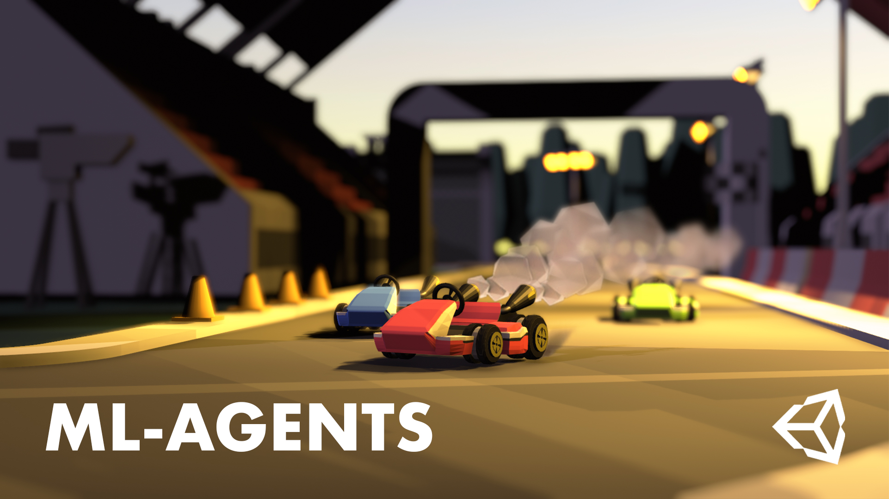
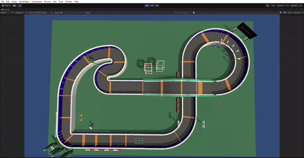

# Trabalho de Aprendizado de Máquina

### Uma comparação dos algoritmos Proximal Policy Optimization(PPO) e Soft-Actor Critic(SAC) para treinar karts em uma pista de corrida com Unity e ML-Agents

 
   
   
  Karts já treinados com PPO correndo na pista

 
 

 
  
   
  Karts já treinados com SAC correndo na pista

