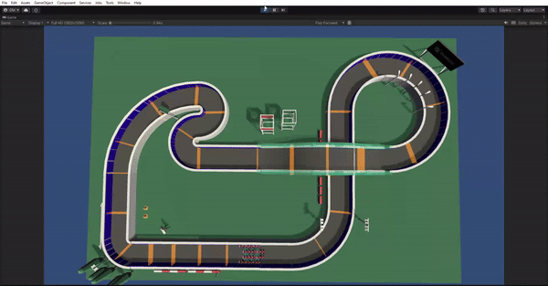

# Trabalho de Aprendizado de Máquina

### Uma comparação dos algoritmos Proximal Policy Optimization(PPO) e Soft-Actor Critic(SAC) para treinar karts em uma pista de corrida com Unity e ML-Agents

 
   
   
  Karts já treinados com PPO correndo na pista

 
 

 
  
   
  Karts já treinados com SAC correndo na pista

## Como rodar os experimentos

Antes de rodar, é necessário ter o Unity hub (https://unity.com/pt/download) e o python em sua versão 3.9.13. Os experimentos foram rodados em um ambiente em Windows.

Abra o projeto pelo Unity Hub, e a versão correta do editor será instalada automaticamente. Com o ambiente virtual em cena (indo no editor e navegando pelos arquivos, abrir a cena SampleScene), faça o seguinte:

1. Em um terminal, vá até a pasta Experimentos, onde tem a definição de um arquivo chamado `requirements.txt`;

2. Dentro da pasta, crie um ambiente virtual do python com o comando `python -m venv {nome do ambiente que vc desejar}` e o ative com `(nome que voce escolheu)\Scripts\Activate`

3. Com o ambiente já ligado, rodar `pip install -r requirements.txt`. Isso irá instalar todas as dependências, tanto para você treinar um agente, quanto para acessar os dados do treinamento.

4. Feito isso, o ML-Agents pode ser usado para treinar os karts, com o comando `mlagents-learn`. Os resultados dos treinamentos podem também ser observados, rodando `tensorboard --logdir results --port 6006`. Ao acessar em qualquer navegador o endereço `localhost:6006`, todos os dados de treinamento de todos os treinamentos que executamos podem ser observados em um página que contém diversos gráficos com informações como crescimento da recompensa, recompensa por curiosidade etc.